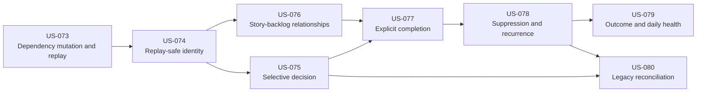

# E09 Self-Improving Harness Lifecycle

## Status

implemented — `US-073` through `US-080` are implemented with replayable proof.

## Intake

- Current local intake: `#177` (numeric intake ids remap on fresh rebuild)
- Durable planning run: `run_1783670632_e09_planning`
- Intake type: `harness_improvement`
- Epic lane: `high-risk`
- Governing decision: `docs/decisions/0008-self-improving-harness-lifecycle.md`
- Review input: `docs/reviews/US-073-proposal-to-backlog-lifecycle.md`

## Goal

Make Harness remember the full lifecycle of its own improvement suggestions so
it can improve repeatedly without proposing the same handled work every day.

## Starting Problem

Before E09, the repository could observe friction and generate proposals, but
could not reliably connect a proposal to acceptance, implementation, proof,
closure, later impact, or recurrence.

The original failure was concrete:

- `harness-cli audit` reports entropy `0/100`.
- `harness-cli propose` still emits the exact patterns already stored as open
  backlog items `#6` and `#7`.
- Current `propose --commit` persists every displayed proposal, not one selected
  proposal.
- Story verification and backlog closure have no structured relationship.
- Local numeric backlog ids and replay-time timestamps are not sufficient for
  relationships that span separate changesets and fresh database rebuilds.

## Product Contract

The Harness improvement loop is human-governed and evidence-backed:

```text
trace, friction, intervention, or audit evidence
  -> propose is read-only
  -> human accepts or rejects one stable proposal key
  -> acceptance creates one accepted occurrence plus an outcome-review schedule
  -> harness_improvement intake
  -> one resolving story plus optional references
  -> agent implementation
  -> completed implementation trace
  -> explicit story completion with fresh proof
  -> accepted backlog occurrence closes as implemented
  -> implementation proof remains separate from measured outcome
  -> old evidence is suppressed but remains queryable
  -> genuinely new evidence becomes regression or reconsideration
```

Harness never deletes historical traces, friction, interventions, completed
stories, or closed backlog outcomes to make proposal output look cleaner.

## Daily Operator Loop

```text
Start of day
  -> record audit-evidence transitions explicitly
  -> inspect improvement health
  -> inspect accepted/open work
  -> inspect new proposals

Decision
  -> accept exactly one proposal key with manual/date/trace-count observation
     schedule, reject it with a reason, or leave it pending

Work
  -> record intake
  -> link one resolving story
  -> run the story through external orchestrators
  -> record its completed implementation trace

Completion
  -> explicit story complete runs fresh proof
  -> story becomes implemented
  -> resolved accepted backlog work closes atomically

Later observation
  -> record whether predicted impact was confirmed, ineffective, or reverted
  -> suppress handled evidence
  -> surface only genuinely new recurrence evidence
```

After E09 is implemented, the concrete operator path is:

```bash
# 1. Make audit state transitions durable, then inspect the day.
scripts/bin/harness-cli audit --record-evidence
scripts/bin/harness-cli query improvement-health
scripts/bin/harness-cli propose

# 2a. Accept one item and choose exactly one observation schedule.
scripts/bin/harness-cli propose --accept <proposal-key> \
  --outcome-after-traces 20

# 2b. Or reject one item without creating implementation work.
scripts/bin/harness-cli propose --reject <proposal-key> \
  --reason "Not worth the added complexity"

# 3. For accepted work, record intake and designate one resolver.
scripts/bin/harness-cli intake --type harness_improvement \
  --summary "<implementation objective>" --lane <normal|high-risk> \
  --story <US-NNN>
scripts/bin/harness-cli story backlog link --story <US-NNN> \
  --backlog <local-id> --relationship resolves

# 4. Review the selected agent workflow, then explicitly authorize execution.
#    Implementation runners are external to Harness and vary by consumer.

# 5. Record the implementation trace; completion runs fresh proof.
scripts/bin/harness-cli story complete <US-NNN>

# 6. When the schedule is due, append the measured result.
scripts/bin/harness-cli backlog outcome record --id <local-id> \
  --status <confirmed|ineffective|reverted> \
  --outcome "<observed effect>" --evidence "<measurement note>"
```

Steps 2a and 2b are alternatives. `--prepare-only` is a review step and does not
authorize the following execution command by itself.

## Invariants

- `propose` without an explicit decision flag never writes.
- Proposal mutation requires exactly one explicit `--accept` or `--reject`
  decision; bare `--commit` writes nothing.
- Default `audit` stays read-only. `audit --record-evidence` is the explicit,
  replayable boundary that opens, clears, or reopens audit evidence episodes.
- A proposal key identifies an underlying issue; a backlog uid identifies one
  occurrence of that issue.
- At most one proposed or accepted backlog occurrence exists for one proposal
  key at a time.
- Only one story may be the designated resolver for one backlog occurrence.
- Ordinary `story verify` and `story verify-all` never close backlog work.
- Explicit completion requires a completion-eligible story and a fresh passing
  verification from that invocation.
- A resolver also requires a linked `harness_improvement` intake and a completed
  implementation trace recorded after its newest resolver link.
- Verification failure leaves the story incomplete and closes nothing.
- Completion, verification state, resolution evidence, and backlog closure are
  written atomically and replayably.
- Implementation closure never writes measured outcome. Later append-only outcome
  observations record whether impact was confirmed, ineffective, or reverted;
  legacy `actual_outcome` remains untouched by E09 commands.
- Keyed accepted lifecycle work cannot bypass completion through manual
  `backlog close --status implemented`.
- Implemented and rejected history is not reopened or overwritten.
- New evidence after implementation is a regression; new evidence after
  rejection is a reconsideration.

## Stories

| Story | Lane | Outcome | Depends on |
| --- | --- | --- | --- |
| `US-073` Story Dependency Mutation And Replay | normal | Add first-class, cycle-safe, replayable dependency authoring so this epic can be enforced by external orchestrators rather than only documented. | none |
| `US-074` Replay-Safe Improvement Identity | high-risk | Add stable intake, proposal, backlog-occurrence, and evidence identity that survives separate changesets and fresh rebuilds. | `US-073` |
| `US-075` Selective Proposal Decision | normal | Accept one key with an observation schedule or reject one key with a reason; both decisions are idempotent and replayable. | `US-074` |
| `US-076` Story-To-Backlog Relationships | high-risk | Add replayable `resolves` and `references` links with one designated resolver. | `US-074` |
| `US-077` Explicit Story Completion And Atomic Closure | high-risk | Add explicit completion that runs fresh proof, marks the story implemented, and closes eligible resolved backlog work atomically. | `US-075`, `US-076` |
| `US-078` Proposal Suppression And Recurrence Classification | normal | Explain handled evidence and distinguish new, pending, accepted, suppressed, regression, and reconsideration states. | `US-077` |
| `US-079` Outcome Observation And Daily Improvement Health | normal | Separate implementation proof from measured impact and provide one read-only daily improvement view. | `US-078` |
| `US-080` Legacy Improvement Reconciliation | high-risk | Conservatively backfill derivable identities, embed replay-safe legacy evidence snapshots, preserve old outcomes neutrally, and report ambiguity without deleting history. | `US-075`, `US-078` |

## Dependency Graph



The critical path is:

```text
US-073 -> US-074 -> (US-075 + US-076) -> US-077 -> US-078
                                                -> (US-079 + US-080)
```

`US-075` and `US-076` are dependency-independent after `US-074` and may execute
in either order. `US-079` and `US-080` are likewise independent after their own
dependencies. The local external orchestrator still executes one active story at a
time.

## Durable Registration Rule

Only `US-073` is registered as runnable during this planning pass. The current
CLI can read dependency edges but cannot safely create or replay them. `US-073`
must add that capability, then register `US-074` through `US-080` and the exact
edges above in the same replayable planning changeset. Until then, the downstream
packets are approved plans, not external orchestrators-ready work.

## Scope

In scope:

- Rust Harness CLI proposal and backlog lifecycle.
- Additive SQLite migrations and semantic changeset replay.
- Stable intake, proposal, occurrence, and evidence identity.
- Story-to-backlog relationship storage and queries.
- Explicit verification-backed completion.
- Suppression, recurrence, and outcome-observation behavior.
- CLI documentation, ADR updates, rebuild proof, and installer propagation.

Out of scope:

- external product UI changes.
- Daemon scheduling or unattended proposal acceptance.
- Automatic implementation or automatic regression backlog creation.
- LLM-based semantic grouping.
- Deleting historical evidence.
- Automatically choosing a canonical row for ambiguous legacy duplicates.
- Release tagging during story implementation.

## Epic Exit Criteria

- Two unchanged `propose` runs return stable ordered output and write nothing.
- One explicit acceptance creates or reuses exactly one accepted occurrence.
- One explicit rejection creates or reuses exactly one rejected occurrence and
  creates no implementation work.
- Intake, story relationship, completion proof, and closure are queryable as one
  explainable chain.
- A planned, retired, unverified, failed, or merely referencing story cannot
  close backlog work.
- Fresh rebuild preserves stable intake/trace identity, evidence coverage,
  relationships, resolution proof, closure, recurrence state, and measured
  outcomes.
- Old evidence remains queryable but does not reappear as new work.
- Post-implementation evidence becomes regression; post-rejection evidence
  becomes reconsideration; neither creates work without human acceptance.
- Daily health distinguishes new proposals, accepted work, scheduled/not-due,
  due/manual outcome review, ineffective or reverted improvements, and
  recurrences.
- Legacy reconciliation handles known generated rows conservatively and leaves
  ambiguous/manual records unchanged.
- Installer smoke proves the new schema and current locally built CLI artifact.

## Epic Validation

```bash
cargo fmt --check
cargo test --workspace
cargo clippy --workspace -- -D warnings
scripts/validate-changeset-rebuild.sh
git diff --check
```

Installer proof must use a locally built CLI release artifact so validation does
not accidentally download the previously published behavior.

## Execution Boundary

This epic and its story packets are planning artifacts. Do not start external orchestrators
until the human explicitly requests execution. When execution is approved,
`US-073` is the only initial runnable story.
